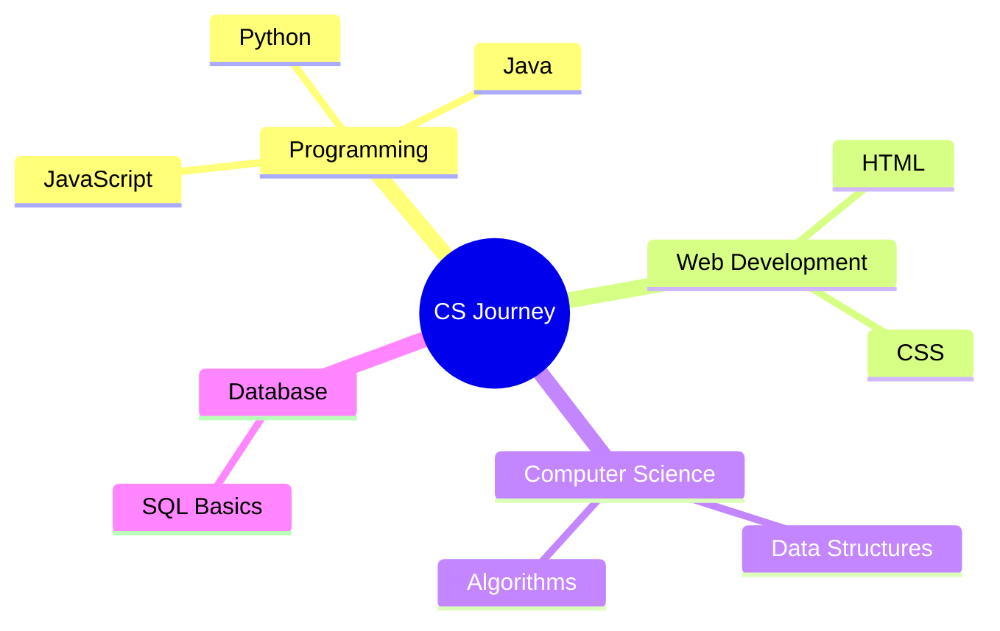

<h1 align="center">
   
  
   
  Jin Park
   
</h1>

<h4 align="center">Computer Science Student | Developer | Researcher</h4>

  
  
  

  <a href="#about-me">About Me</a> •
  <a href="#currently-learning">Currently Learning</a> •
  <a href="#future-projects">Future Projects</a> •
  <a href="#research-interests">Research Interests</a>

---

## 🌟 About Me

Hello! I'm a passionate computer science student just beginning my journey in the world of technology. With a keen interest in problem-solving and creating innovative solutions, I'm excited to build my skills and knowledge in various areas of computer science.

When I'm not coding or studying, you'll find me exploring new music, enjoying a good book, or diving into the latest tech trends. I'm particularly interested in [Your Specific Interests] and hope to contribute to these fields in the future.

  
  

## 🎓 Currently Learning

📚 Courses I'm Taking

 

| Course | Progress |
| --- | --- |
| Introduction to Computer Science | 🟢🟢🟢⚪⚪ |
| Programming Fundamentals | 🟢🟢⚪⚪⚪ |
| Data Structures and Algorithms | 🟢⚪⚪⚪⚪ |
| Web Development Basics | 🟢🟢⚪⚪⚪ |

## 🚀 Future Projects

While I don't have public repositories yet, I'm excited about the projects I'll be working on soon. Here are some ideas I'm planning to explore:

<table>
  <tr>
    <td width="50%">
      <h3 align="center">Personal Portfolio Website</h3>
      

        
      

      
A responsive portfolio website built with modern front-end technologies to showcase my projects and skills.

    </td>
    <td width="50%">
      <h3 align="center">Simple Task Management App</h3>
      

        
      

      
A beginner-friendly task management application to practice CRUD operations and basic UI design.

    </td>
  </tr>
  <tr>
    <td width="50%">
      <h3 align="center">Algorithm Visualization Tool</h3>
      

        
      

      
An interactive tool to visualize common sorting and searching algorithms to better understand their mechanisms.

    </td>
    <td width="50%">
      <h3 align="center">Educational Quiz App</h3>
      

        
      

      
A simple quiz application to test knowledge on computer science concepts and programming fundamentals.

    </td>
  </tr>
</table>

## 🔬 Research Interests

  

    <h3>🧠 Artificial Intelligence</h3>
    
Exploring the fundamentals of AI and machine learning algorithms.

  

  

    <h3>📊 Data Science</h3>
    
Learning about data analysis, visualization, and deriving insights from data.

  

  

    <h3>🔐 Cybersecurity</h3>
    
Understanding the basics of network security and ethical hacking.

  

  

    <h3>🌐 Web Development</h3>
    
Building interactive and responsive web applications with modern technologies.

  

## 📈 GitHub Stats

  
  

## 🎯 Goals for 2025

- [ ] Complete foundational computer science courses
- [ ] Build and publish first 3 projects on GitHub
- [ ] Contribute to an open-source project
- [ ] Learn a new programming language
- [ ] Participate in a hackathon

---

  

💜 Thanks for visiting my profile! 💜

  

